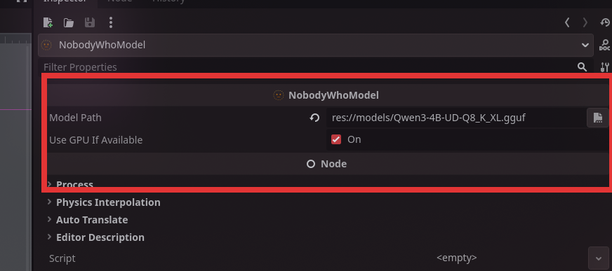

# Getting Started
_A minimal, end-to-end example showing how to load a model and perform a single chat interaction._ 

---

Cool, the plugin is now enabled! Now let's understand how everything works together.

One of the most important components of NobodyWho is the Chat node. It handles all the conversation logic between the user and the LLM.
When you use the chat, you first pick a model and tell it what kind of answers you want.
When you send a message, the chat remembers what you said and sends it off to get an answer. 
The model will then start reading and generating a response.
You can choose to wait for the full answer to generate or get the response in a stream.

Here are the key terms you'll see throughout this guide:

| Term | Meaning |
| ---- | ------- |
| **Model (GGUF)** | A `*.gguf` file that holds the weights of a large‑language model. |
| **System prompt** | Text that sets the ground rules for the model. |
| **Token** | The smallest chunk of text the model emits (roughly a word). |
| **Chat** | The node/component that owns the context, sends user input to the worker, and keeps conversation state in sync with the LLM. |
| **Context** | The message history and metadata passed to the model each turn; it lives inside the Chat. |
| **Worker** | NobodyWho's background task for a single conversation — it keeps the model ready and acts a a communication layer between the program and the model. Each Chat has its own worker. |

Let's show you how to use the plugin to get a large language model to answer you.

## Download a GGUF Model

The first step is to get a model.
If you're in a hurry, just download [Qwen_Qwen3-4B-Q4_K_M.gguf](https://huggingface.co/bartowski/Qwen_Qwen3-4B-GGUF/resolve/main/Qwen_Qwen3-4B-Q4_K_M.gguf). 
It's pretty good and we will base our tutorials around this model. 

Otherwise, check out our [recommended models](model-selection.md) or if you have a non-standard use case, shoot us a question in Discord.

## Load the GGUF model

At this point you should have downloaded the model and put it into your project folder.

=== ":simple-godotengine: Godot"

    Add a `NobodyWhoModel` node to your scene tree.

    Set the model path to point to your GGUF model. (1)
    { .annotate }

    1. 

=== ":simple-unity: Unity"

    Make sure that the model is downloaded and put inside your `project-root:/Assets/StreamingAssets/`

    Create a new scene in your project and add the `NobodyWho > Model` component, then use the file finder to get your model.
    Make sure to have GPU acceleration enabled for faster responses at the cost of VRAM.

## Create a new Chat

The next step is adding a Chat to our scene. 

=== ":simple-godotengine: Godot"

    Add a `NobodyWhoChat` node to your scene tree.

    Then add a script to the node:

    ```gdscript
    extends NobodyWhoChat

    func _ready():
        # configure the node (feel free to do this in the UI)
        self.system_prompt = "You are an evil wizard."
        self.model_node = get_node("../ChatModel")

        # connect signals to signal handlers
        self.response_updated.connect(_on_response_updated)
        self.response_finished.connect(_on_response_finished)

        # Start the worker, this is not required, but recommended to do in
        # the beginning of the program to make sure it is ready
        # when the user prompts the chat the first time. This will be called
        # under the hood when you use `say()` as well.
        self.start_worker()

        self.say("How are you?")

    func _on_response_updated(token):
        # this will print every time a new token is generated
        print(token)

    func _on_response_finished(response):
        # this will print when the entire response is finished
        print(response)
    ```

=== ":simple-unity: Unity"

    The next step is adding the Chat object.`NobodyWho > Chat`.
    Make sure to select the model you just added in the model field.

    It has a lot of options - but for now we are only going to focus on the System prompt.
    These are the instructions that the LLM will try to follow. (1)
    { .annotate }

    1. 


    ---

    Now we are ready to add a small script that sends and receives text from the model.
    Add a new script component on you chat object:

    ```csharp
    using UnityEngine;

    public class SendMessageToChat : MonoBehaviour
    {
        public Chat chat;

        void Start()
        {
            chat = GetComponent<Chat>();

            // start the worker, this is not required, but recommended to do in
            // the beginning of the program to make sure it is ready when the user
            // prompts the chat the first time. this will be called under the hood
            // when you use `say()` as well.
            chat.StartWorker();

            // add a listener to the responseFinished event, this will be called when
            // the model has completed its answer.
            chat.responseFinished.AddListener(OnResponseFinished);
            // this will update everytime that a new token is generated
            chat.responseUpdated.AddListener(OnResponseUpdated);

            // send a message to the model
            chat.Say("Hey there kitten, nice to meet you!");
        }

        void OnResponseUpdated(string update)
        {
            Debug.Log(update);
        }
        void OnResponseFinished(string fullResponse)
        {
            Debug.Log(fullResponse);
        }
    }
    ```


## Testing Your Setup

That's it! You now have a working chat system that can talk to a language model. When you run your scene, the chat will automatically send a test message and you should see the model's response appearing in your console.

You should see tokens appearing one by one as the model generates its response, followed by the complete answer. If you see the evil wizard responding with curses (or whatever system prompt you chose), everything is working correctly!

**If nothing happens:**

- Make sure your model file path is correct
- Verify that your Chat node is properly connected to your Model node
- Look for any error messages in the console
- Start your editor through the command line and check the stdout logs.

Now you're ready to build more complex conversations and integrate the chat system into your game!
