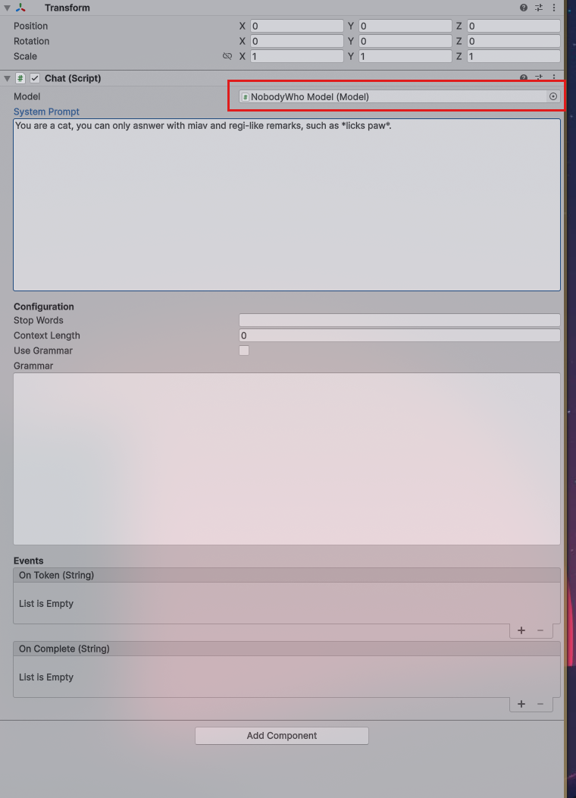

# Baby's First Steps
_A minimal, end-to-end example showing how to load a model and perform a single chat interaction._ 

---

Lets show you how to use the plugin to get a large language model to answer you.

## Download a GGUF Model

If you're in a hurry, just download [Qwen_Qwen3-4B-Q4_K_M.gguf](https://huggingface.co/bartowski/Qwen_Qwen3-4B-GGUF/resolve/main/Qwen_Qwen3-4B-Q4_K_M.gguf). It's pretty good.
Otherwise, check out our [recommended models](model-selection.md)


## Load the GGUF model

=== ":simple-godotengine: Godot"

    Add a `NobodyWhoModel` node to your scene tree.

    Set the model path to point to your GGUF model.

=== ":simple-unity: Unity"

    Make sure that the model is downloaded and put inside your `project-root:/Assets/StreamingAssets/`

    Create a new scene in your project and add the `NobodyWho > Model` object and use the file finder to find your model.
    Make sure to have GPU acceleration enabled for faster responses at the cost of VRAM.


## Create a new Chat

The next step is adding a Chat to our scene. 

=== ":simple-godotengine: Godot"

    Add a `NobodyWhoChat` node to your scene tree.

    Then add a script to the node:

    ```gdscript
    extends NobodyWhoChat

    func _ready():
        # configure the node (feel free to do this in the UI)
        self.system_prompt = "You are an evil wizard. Always try to curse anyone who talks to you."
        self.model_node = get_node("../ChatModel")

        # connect signals to signal handlers
        self.response_updated.connect(_on_response_updated)
        self.response_finished.connect(_on_response_finished)

        # start the LLM worker (this takes a second)
        self.start_worker()

        self.say("How are you?")

    func _on_response_updated(token):
        # this will print every time a new token is generated
        print(token)

    func _on_response_finished(response):
        # this will print when the entire response is finished
        print(response)
    ```

=== ":simple-unity: Unity"

    Next steps is adding the Chat object.`NobodyWho > Chat`.
    Make sure to select the model you just added in the model field.

    It has a lot of options - but for now we are only going to focus on the System prompt.
    These are the instructions that the LLM will try to follow. 

    


    ---

    Now we are ready top add a small script that sends and recieves text from the model.
    Add a new script component on you chat object:

    ```csharp
    using UnityEngine;

    public class SendMessageToChat : MonoBehaviour
    {
        public Chat chat;

        void Start()
        {
            chat = GetComponent<Chat>();

            // start the worker, this is not required, but recommended to do in the beggining of the program to make sure it is ready
            // when the user prompts the chat the first time.
            chat.StartWorker();

            // add a listener to the responseFinished event, this will be called when the model has completed its answer.
            chat.responseFinished.AddListener(OnResponseFinished);

            // send a message to the model
            chat.Say("Hey there kitten, nice to meet you!");
        }

        void OnResponseFinished(string fullResponse)
        {
            Debug.Log(fullResponse);
        }
    }
    ```


    


    

