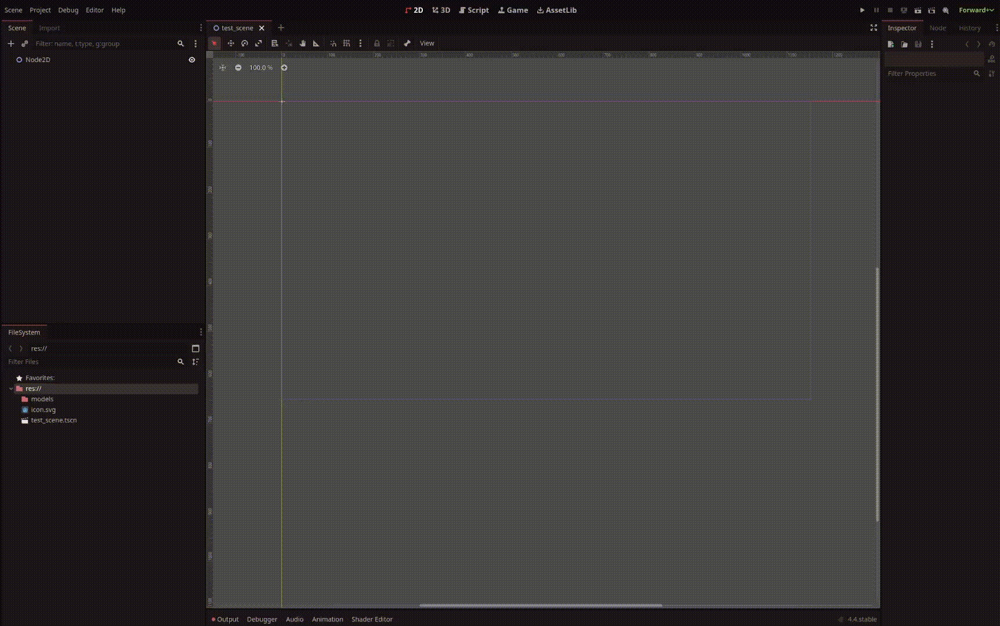
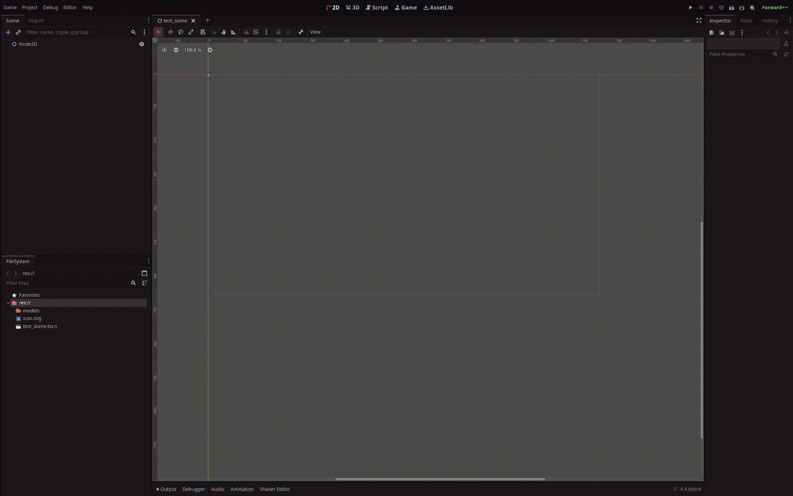

# Installation
_How to install NobodyWho and start building._

---

So you decided to try out NobodyWho and install it; Welcome! 

The plugin is currently available in **Godot** or **Unity**.  
Each section contains a small ':material-eye-circle-outline:' marker you can click to reveal a GIF or image to guide you.

### Via Asset Library

=== ":simple-godotengine: Godot"

    - **Open Godot 4.4** (or any newer 4.x release).
    - Switch to the **Asset Library** tab.
    - Search for **“NobodyWho”** and select the entry.
    - Click **Download**, tick **Ignore asset root**, then choose **Install**.
    - Godot puts the plugin in `res://addons/nobodywho`. Open *Create Node* and you should see **`NobodyWhoChat`**. If it’s missing, restart Godot and try again. 
 
    (1)
    { .annotate }

    1. 

=== ":simple-unity: Unity"

    The package isn’t on the Asset Store yet — use the GitHub method below until it arrives.

### Via GitHub

=== ":simple-godotengine: Godot"

    - Download the latest ZIP from the [GitHub releases](https://github.com/nobodywho-ooo/nobodywho/releases).
    - In Godot, open **AssetLib ▸ Import** and pick the ZIP.
    - Tick **Ignore asset root** and finish the import. 
    
    (1)
    { .annotate }

    1. 

=== ":simple-unity: Unity"

    - Download the tarball (`nobodywho-unity-upm.tar.gz`) for unity from the [GitHub releases](https://github.com/nobodywho-ooo/nobodywho/releases).
    - In Unity, open the **Package Manager** and select the downloaded tarball.
    - Step through the import dialog to bring everything in.
    - To explore the samples, open y, select **NobodyWho**, then **Samples ▸ Install**. 

    (1)
    { .annotate }

    1. 

---

After installation, NobodyWho’s nodes (Godot) or components (Unity) should appear in your editor. If not, trace your steps above or reach out on Discord or GitHub - we are there to help.
