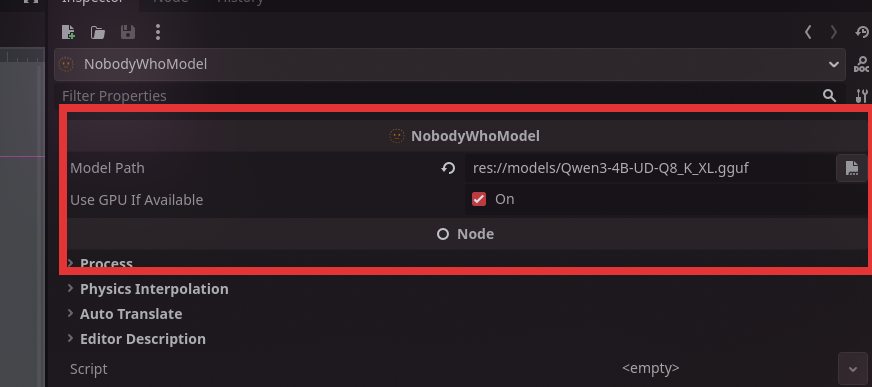

# Getting Started
_A minimal, end-to-end example showing how to load a model and perform a single chat interaction._ 

---

One of the most important components of NobodyWho is the Chat node. It handles all the conversation logic between the user and the LLM.
When you use the chat, you first pick a model and tell it what kind of answers you want.
When you send a message, the chat remembers what you said and sends it off to get an answer. 
The model will then start reading and generating a response.
You can choose to wait for the full answer to generate or get the response in a stream.

Here are the key terms you'll see throughout this guide:

| Term | Meaning |
| ---- | ------- |
| **Model (GGUF)** | A `*.gguf` file that holds the weights of a large‑language model. |
| **System prompt** | Text that sets the ground rules for the model. |
| **Token** | The smallest chunk of text the model emits (roughly a word). |
| **Chat** | The node/component that owns the context, sends user input to the worker, and keeps conversation state in sync with the LLM. |
| **Context** | The message history and metadata passed to the model each turn; it lives inside the Chat. |
| **Worker** | NobodyWho's background task for a single conversation — it keeps the model ready and acts as a communication layer between the program and the model. Each Chat has its own worker. |

Let's show you how to use the plugin to get a large language model to answer you.

## Download a GGUF Model

The first step is to get a model.
If you're in a hurry, just download [Qwen3 0.6B Q4_K_M](https://huggingface.co/NobodyWho/Qwen_Qwen3-0.6B-GGUF/resolve/main/Qwen_Qwen3-0.6B-Q4_K_M.gguf).
It's super small and fast, and works for well for simple use-cases.

Otherwise, check out our [recommended models](../model-selection.md) or if you have a non-standard use case, shoot us a question in Discord.

## Load the GGUF model

At this point you should have downloaded the model and put it into your project folder.


Add a `NobodyWhoModel` node to your scene tree.

Set the model path to point to your GGUF model. (1)
{ .annotate }

1. 

### Supported model path formats

The `model_path` field (and `projection_model_path` for vision models) accepts several forms:

| Form | Example | Notes |
| ---- | ------- | ----- |
| Godot resource path | `res://models/my-model.gguf` | Bundled with your game export |
| User data path | `user://downloaded.gguf` | Written by your game at runtime |
| Absolute filesystem path | `/opt/models/foo.gguf` | Local file |
| HuggingFace reference | `huggingface:owner/repo/file.gguf` or `hf://owner/repo/file.gguf` | Downloaded & cached on first use |
| HTTPS URL | `https://example.com/model.gguf` | Downloaded & cached on first use |

Remote models are downloaded to the platform cache directory on the first load and re-used on subsequent runs. Downloads happen on a background thread — the Godot main loop stays responsive while a multi-GB model is fetched.

### Showing download progress

`NobodyWhoModel` emits a `download_progress(downloaded, total)` signal while a remote model is downloading, throttled to roughly 10 Hz with a guaranteed final emit on completion. Connect it if you'd like to drive a progress bar:

```gdscript
model.download_progress.connect(func(downloaded: int, total: int):
    print("%d / %d bytes" % [downloaded, total])
)
```

The signal is not emitted for local files or already-cached downloads.

### Knowing when the worker is ready

`start_worker()` returns immediately. The worker finishes loading in the background (including any download). Connect to the new signals if your game logic needs to wait:

```gdscript
chat.worker_started.connect(func():
    print("Ready to chat!")
)
chat.worker_failed.connect(func(err):
    push_error("Model load failed: " + err)
)
chat.start_worker()
```

You can also call `ask()` straight away — prompts issued before the worker is ready are queued and dispatched as soon as loading completes. The same applies to `NobodyWhoEncoder.encode()` and `NobodyWhoCrossEncoder.rank()`.


## Create a new Chat

The next step is adding a Chat to our scene. 


Add a `NobodyWhoChat` node to your scene tree.

Then add a script to the node:

```gdscript
extends NobodyWhoChat

func _ready():
    # configure the node (feel free to do this in the UI)
    self.system_prompt = "You are an evil wizard."
    self.model_node = get_node("../ChatModel")

    # connect signals to signal handlers
    self.response_updated.connect(_on_response_updated)
    self.response_finished.connect(_on_response_finished)

    # Start the worker, this is not required, but recommended to do in
    # the beginning of the program to make sure it is ready
    # when the user prompts the chat the first time. This will be called
    # under the hood when you use `ask()` as well.
    self.start_worker()

    self.ask("How are you?")

func _on_response_updated(token):
    # this will print every time a new token is generated
    print(token)

func _on_response_finished(response):
    # this will print when the entire response is finished
    print(response)
```

## Testing Your Setup

That's it! You now have a working chat system that can talk to a language model. When you run your scene, the chat will automatically send a test message and you should see the model's response appearing in your console.

You should see tokens appearing one by one as the model generates its response, followed by the complete answer. If you see the evil wizard responding with curses (or whatever system prompt you chose), everything is working correctly!

**If nothing happens:**

- Make sure your model file path is correct
- Verify that your Chat node is properly connected to your Model node
- Look for any error messages in the console
- Start your editor through the command line and check the stdout logs.

Now you're ready to build more complex conversations and integrate the chat system into your game!
