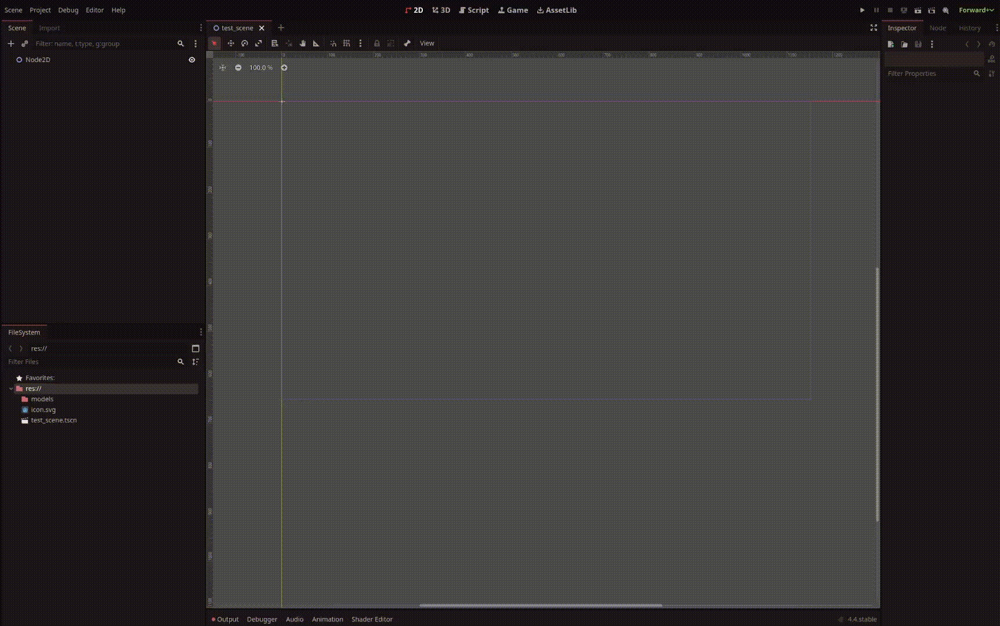
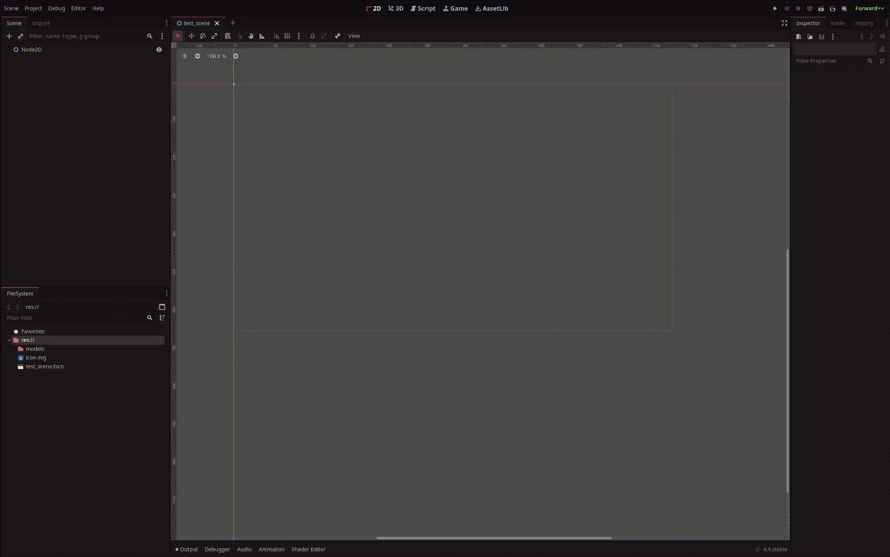

# Installation
_How to install NobodyWho and start building._

---

### Via Asset Library

- **Open Godot 4.4** (or any newer 4.x release).
- Switch to the **Asset Library** tab.
- Search for **“NobodyWho”** and select the entry.
- Click **Download**, tick **Ignore asset root**, then choose **Install**.
- Godot puts the plugin in `res://addons/nobodywho`. Open *Create Node* and you should see **`NobodyWhoChat`**. If it’s missing, restart Godot and try again. 

(1)
{ .annotate }

1. 

### Via GitHub

- Download the latest ZIP from the [GitHub releases](https://github.com/nobodywho-ooo/nobodywho/releases).
- In Godot, open **AssetLib ▸ Import** and pick the ZIP.
- Tick **Ignore asset root** and finish the import. 

(1)
{ .annotate }

1. 

---

After installation, NobodyWho’s nodes should appear in your editor. If not, retrace your steps above or reach out on Discord or GitHub - we are there to help.
