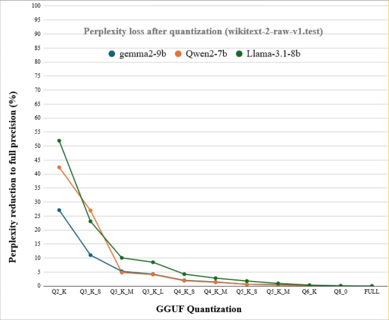

Choosing the right language model can make or break your project. In general you want to go as small as possible while still having the capabilities you need for your application.

## TL;DR

If you just want a ~2GB chat model that works well, use:

```
huggingface:NobodyWho/Qwen_Qwen3-4B-GGUF/Qwen_Qwen3-4B-Q4_K_M.gguf
```

If you want something smaller and faster, use:

```
huggingface:NobodyWho/Qwen_Qwen3-0.6B-GGUF/Qwen_Qwen3-0.6B-Q4_K_M.gguf
```

Pass these as the model path when creating a `Chat`, `Model`, `Encoder`, etc. NobodyWho will download the model automatically and cache it locally for future use.


## Getting a model

NobodyWho can download models directly from Hugging Face. Instead of downloading a file manually, pass a `huggingface:` path where you'd normally pass a file path:

```
huggingface:owner/repo/filename.gguf
```

The model is downloaded once and cached locally — no internet connection is needed after the first load. `hf:` is also accepted as a shorthand.

You can also pass a full `https://` URL to download a model from any host.

Of course, you can still pass a local file path if you prefer to manage model files yourself.

We recommend starting with the models on our [Hugging Face page](https://huggingface.co/NobodyWho) since they are known to work well with NobodyWho.

Once you're more familiar, you can also try models from [Bartowski](https://huggingface.co/bartowski) and [Unsloth](https://huggingface.co/unsloth/models).

Broadly, almost any `.gguf` model on [Hugging Face](https://huggingface.co) should work, though some may fail due to formatting issues.


## Understanding model file names

Model files follow a naming convention like this: `Qwen_Qwen3-0.6B-Q4_K_M.gguf`

Here's what each part means:

- `Qwen` the organization that trained the model.
- `Qwen3` the name of the model release.
- `0.6B` the parameter count in billions. This model has 0.6 billion (600 million) parameters.
- `Q4` the quantization level, i.e. the number of bits used per parameter.
- `K_M` details about the quantization technique. `S` is faster but less precise, `L` is slower but more precise, and `M` is a middle ground. You don't need to worry too much about this for now.

For chatting, you'll need an instruction-tuned GGUF file that includes a Jinja2 chat template in its metadata. This describes the vast majority of GGUF files available, so if you're unsure, just try it — NobodyWho will give you a descriptive error message if something isn't right.

For embeddings or cross-encoding, you'll need models specifically designed for those tasks, they are typically named accordingly. Although note that cross-encoding models are sometimes referred to as "reranking" models.


## Quantization

Quantization refers to the practice of reducing the number of bits per weight.
This can make the model faster and smaller, with a relatively small loss in response quality.

Generally speaking, you can used models quantized down the Q4 or Q5 levels (4 or 5 bits per weight respectively),
while loosing barely any accuracy.

Look at the plot below to get a feel for how quantization levels differ.
It shows the models' ability to predict text on the y-axis versus the number of bits per weight on the x-axis.



In general, it's preferable to use a model with more parameters and fewer bits per parameter, as compared to a model with fewer parameters and more bits per parameter.
Your results may vary.


## Estimating Memory Usage

The memory requirement of a model is roughly its parameter count multiplied by its quantization level.

Here's a few examples:

- 2B @ Q8 ~= 2GB
- 2B @ Q4 ~= 1GB
- 14B @ Q4 ~= 7GB
- 14B @ Q2 ~= 3.5GB
- ..and so on


## Comparing Models

There are many places online for comparing benchmark scores of different LLMs, here's a few of them:

**[LLM-Stats.com](https://llm-stats.com/)**
- Includes filters for open models and small models.
- Compares recent models on a few different benchmarks.

**[OpenEvals on huggingface](https://huggingface.co/spaces/OpenEvals/find-a-leaderboard)**
- A collection of benchmark leaderboards in different domains.
- Includes both inaccessible proprietary models and open models.

Remember that you need an open model, in order to be able to find a GGUF download and run it locally (e.g. Gemma is open, but Gemini isn't).


---

*Need help choosing between specific models? Check our [community Discord](https://discord.gg/qhaMc2qCYB).* 
